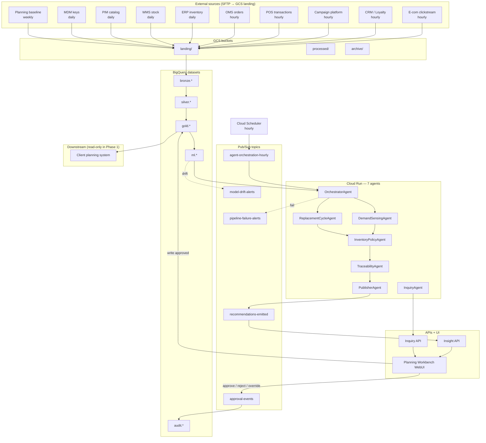
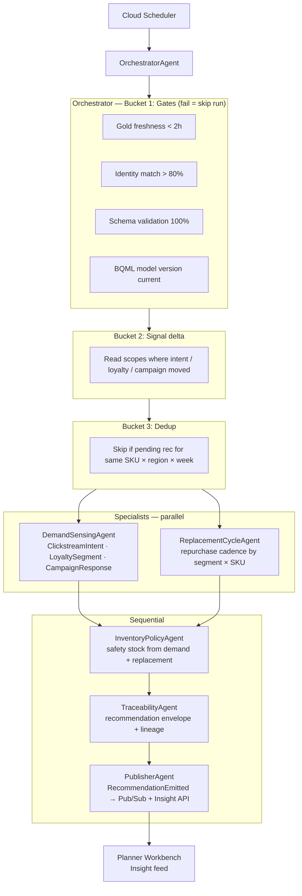
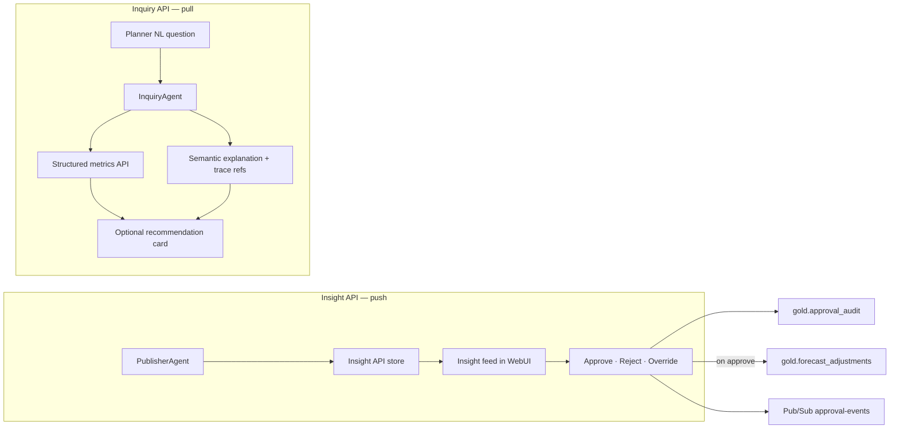

# UC1 — Agent Architecture

Mermaid versions (paste into Miro, Notion, or GitHub).  
Source: `Retail _ Consumer - Planner Loop.pdf` §4 (agents) + §8.2 (deployment topology).

---

## 1. End-to-end deployment topology

**Gold tables agents consume:** `intent_signal_hourly`, `member_sales_attributed`, `forecast_baseline`, `customer_segment`, `replacement_scores`.

**Gold tables planner writes:** `forecast_adjustments`, `approval_audit`.

---

## 2. Hourly agent orchestration (Sense → Reason → Act)

**Demo mode:** static Gold breaks freshness gates — use `DEMO_MODE=true` or UI toggle reading pre-staged Run 1 / Run 2 (see Agent Build Handover §7).

---

## 3. Planner interaction paths

**Rule:** recommend-only in Phase 1 — nothing auto-applies to client planning systems.

---

## 4. Agent inventory (quick reference)

| Agent | Role | Trigger |
|-------|------|---------|
| OrchestratorAgent | Gates + signal delta + routing | Hourly (Scheduler → Pub/Sub) |
| DemandSensingAgent | Intent + loyalty + campaign → `units_intent_adjusted` | Routed by Orchestrator |
| ReplacementCycleAgent | Repurchase likelihood by segment × SKU | Parallel with Demand Sensing |
| InventoryPolicyAgent | Safety stock from demand + replacement | After specialists |
| TraceabilityAgent | Recommendation envelope + lineage | Before publish |
| PublisherAgent | `RecommendationEmitted` → Pub/Sub + Insight API | Last in hourly loop |
| InquiryAgent | On-demand planner Q&A | Planner request |

Phase 2 (out of scope): Promotion Optimization Agent, Store Execution Agent.

---

*Forward Deploy Consulting · UC1 · Jun 2026*
