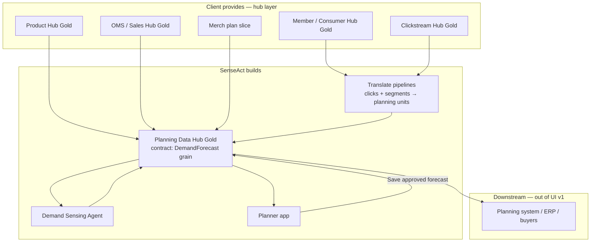

# Show & Tell — Planner Application Flow
**Forward Deploy Consulting · Jun 2026 · Draft v0.2**

Aligned with: Jun 1 working session (Parul + Anil), hub strategy, business ontology, UI wireframe v0.1.

---

## 1. Scope boundary (from Jun 1)

**We own:** Intelligence at the **hub layer** — clean gold contracts, translation of consumer signals into **planning language**, agent recommendations, and a planner-facing app that replaces the Excel sidecar.

**We do not own:** Upstream source-system ingestion, ERP/WMS/POS plumbing, or adjacent domains (allocation execution, replenishment, full MFP). Client provides the **tap outside the house** (accessible hubs or marts); we do **pressure washing** on top.

| Hub | Role in UI | Planner sees? |
|---|---|---|
| **Product Hub** | Style/SKU/UPC, category, season, attributes | Yes — row identity, filters |
| **OMS / Sales Hub** | Historical sales, returns, promo flags | Yes — baseline forecast input |
| **Member / Consumer Hub** | Segments, CLV tiers, member vs guest KPIs (aggregated) | Yes — filters & insight context, not raw PII |
| **Clickstream Hub** | Browse, search, cart events | No raw events — only via translation |
| **Planning Data Hub (Gold)** | As-is planning inputs + **translated** consumer signals | **Primary read/write** for sessions |
| **Merch plan slice** | Category OTB, sales/margin targets (high level) | Yes — Panel 1, read-only |

**Join rule (unchanged):** Marketing still consumes Member/Consumer Gold. Planning UI and agents read **Planning Data Hub Gold only** — units × SKU × region × week, not raw `clv_score` or clickstream rows.

---

## 2. Paragraphs for UI build (send to Anil)

*Copy-paste ready — describes minimum viable planner workflow without wireframes.*

### Paragraph A — Who and what

The user is a **demand planner** (or merchandise planner doing in-season forecasting) at a mid-market retailer. Most of their real work still happens in **Excel outside o9/Toolio** because enterprise tools are stale, aggregate, or missing forward consumer signals. Our app is an **accelerator**: Excel-familiar grid for weekly unit forecasts by SKU and region, plus a switch that reruns the forecast **with or without** consumer intelligence already translated into planning units. We are not rebuilding allocation, replenishment, or assortment line-building in v1.

### Paragraph B — Session workflow

The planner **logs in**, clicks **Start planning session**, and selects **season**, **category** (e.g. Footwear › Trail), **region** (e.g. Pacific NW), and **week range** (e.g. W42–W48 in-season). The app loads **read-only merch context** from the merch-plan slice (OTB remaining, plan vs actual YTD) and the **forecast workspace** from Planning Data Hub Gold: baseline units from sales history, actuals where loaded, and optional overrides. They review **exceptions** (SKUs with largest forecast change), open a **signals panel** that explains adjustments in planner language (search spike → +220 units, browse-to-buy gap → +180 units), and choose **Accept enriched forecast**, **Keep baseline**, or **Edit overrides** per style. When they **Save session**, the approved `DemandForecast` records (baseline and/or enriched, confidence, audit trail) are written back to **Planning Data Hub Gold** for downstream planning systems, buy conversations, and Show & Tell comparison — we do not push POs or transfer orders from this app.

### Paragraph C — Data sources and Show & Tell hook

**Data sources exposed in the UI** map to hubs, not upstream POS/Adobe tables: Product Hub (SKU/style), OMS/Sales Hub (history & actuals), Merch plan slice (targets), Planning Data Hub (forecast rows + translated signals). **Consumer signals** are controlled by a single toggle: **OFF** = Run 1 (historical + promo calendar only); **ON** = Run 2 (same pipeline + Forward Demand Signal from Clickstream + Member hubs, already aggregated to style × region × week). The planner can **rerun** the session after flipping the toggle without re-entering filters. First-time users see Run 1 by default; the sales story is the **delta** on the same grid. Later accelerators can add hindsight (forecast vs actual), team activity dashboards, and deeper merch editing — not in the first draft.

---

## 3. End-to-end flow (planner + data + agents)

---

## 4. Planner journey (screen flow)

| Step | Screen / action | Hub / entity | Notes |
|---|---|---|---|
| **0** | Login | — | Role: demand planner |
| **1** | Home — open or resume sessions | Planning Data Hub | List sessions: season, category, status |
| **2** | **New session** — wizard | Season, Location, Product | Season `FA26`, region `region_canonical`, category from Product Hub |
| **3** | Load context | Merch slice + Product + OMS | Panel 1: OTB, YTD vs plan; validate SKU list in scope |
| **4** | **Forecast workspace** (default) | `DemandForecast` | Grid: `units_historical`, actuals, override columns |
| **5** | Toggle **Consumer signals** | Forward Demand Signal data product | OFF = Run 1; ON = recompute → `units_intent_adjusted`, `units_final` |
| **6** | Review **exceptions + insights** | Translated signals in PDH | Five insight types; units language only |
| **7** | **Human-in-the-loop** | `DemandForecast` + audit | Accept / Keep baseline / per-cell override |
| **8** | **Save session** | Write to PDH Gold | `forecast_source`, `confidence_score`, approver, timestamp |
| **9** | Export / handoff (read-only) | PDH → downstream | Message: buy/allocation consume this; not built here |

### Session states

| State | Meaning |
|---|---|
| `draft` | Planner editing; not visible downstream |
| `pending_review` | Enriched run generated; awaiting accept |
| `approved` | `units_final` locked for handoff |
| `baseline_only` | Run 1 saved intentionally (Show & Tell control) |

---

## 5. Planning session object (logical model)

| Field | Source | Example |
|---|---|---|
| `session_id` | App | `sess_2026_fa26_trail_pnw_042` |
| `planner_id` | Auth | `parvi.k` |
| `season_code` | Season entity | `FA26` |
| `category` | Product Hub | `Footwear › Trail` |
| `region_canonical` | Location Hub | `US-PNW` |
| `week_start` / `week_end` | Session wizard | `2026-10-13` – `2026-11-24` |
| `consumer_signals_enabled` | Toggle | `false` → `true` |
| `run_id` | Pipeline | `run_baseline_001` / `run_enriched_002` |
| `status` | Workflow | `pending_review` |
| `approved_at` | HITL | timestamp |

**Child rows:** `DemandForecast` per (`sku_id`, `location_id`, `week`) with `units_historical`, `units_intent_adjusted`, `units_replacement_adjusted`, `units_final`, `confidence_score`, `forecast_source`.

---

## 6. Hub → UI panel mapping

| UI panel | Hubs read | Glossary entities | Planner can edit? |
|---|---|---|---|
| **Merch context** | Merch slice + Season | Season, category $ targets | No (v1) |
| **Forecast grid** | PDH + Product + OMS | `DemandForecast`, `Product`, `Transaction` (aggregated) | Override cells only |
| **Signals + exceptions** | PDH (translated columns) | Forward Demand Signal, `IntentSignal` (aggregated) | No — explain only |
| **HITL footer** | App state | Audit on `DemandForecast` | Accept / reject run |

**Never in grid (v1):** raw `search_query`, `master_id`, `clv_score`, allocation quantities, PO numbers.

---

## 7. Translate layer (Clickstream + Member → Planning Hub)

This is the work Parul is joining in the shared drive — inputs/outputs for PDH:

| Input (from hubs) | Transform | Output (PDH column / insight) |
|---|---|---|
| `IntentSignal` aggregated by style × region × week | Weighted intent index | `intent_units_lift` |
| Member browse with OOS | Browse-to-buy gap | Insight + unit adjustment |
| `Transaction` member vs guest | Split demand | `units_member`, `units_guest` |
| `DataScienceOutput` (routed_to=planning) | Segment → SKU affinity | Optional lift factor |
| OMS sales history | Statistical baseline | `units_historical` |

**Agent role:** Demand Sensing Agent reads PDH Gold, proposes `units_intent_adjusted`; planner approves → `units_final`.

---

## 8. Show & Tell demo script (5 min)

1. **Login** → Home → **New session** FA26 / Trail / PNW / W42–48  
2. **Signals OFF** — show baseline 1,850 units; insights greyed ("consumer loop disconnected")  
3. **Flip toggle ON** — grid updates to 2,400; exception queue highlights Targhee IV  
4. Walk **five insights** — each ends in units  
5. **Accept enriched** — status Approved, audit line  
6. **Save session** — "Written to Planning Data Hub; your ERP/planning system consumes `units_final`"  
7. **Footer** — we stop at forecast; allocation is another engagement  

---

## 9. Build phases (accelerator mindset)

| Phase | Deliverable | Owner |
|---|---|---|
| **v0.1** | Click-through UI mock (70%) from paragraphs + wireframe | Anil |
| **v0.2** | Parul iteration feedback → 90% | Parul + Anil |
| **v0.3** | Static data from sample PDH contract | Parul |
| **v1** | Toggle wired to pipeline (BigQuery Gold) | Data engineer + Parul |
| **Later** | Hindsight vs actual, admin dashboards, merch edit | Backlog |

**Data engineer (Jun 1):** Bronze→Silver→Gold per hub; client may skip layers if contract already satisfied; feed agents from Gold.

---

## 10. Explicitly later (organic additions)

- Forecast vs actual feedback loop (post-season)  
- "How many planners completed sessions today" ops dashboard  
- Deeper merch planning edit (MFP replacement)  
- Allocation screens (UC2) · Replenishment screens (UC3)  

---

## 11. Open sync items

- [ ] Parul: finalize clickstream + planning field join doc in shared drive (sample values)  
- [ ] Anil: mock from §2 paragraphs + [wireframe](./UI%20Wireframe.md)  
- [ ] Add data engineer to Miro; walk ontology + [connected loop diagram](../../../diagrams/connected_loop_tobe_dataflow.md)  
- [ ] Align PRD assumptions: "hubs exist" vs "we build hubs" per client  

---

*Forward Deploy Consulting · Jun 2026*
