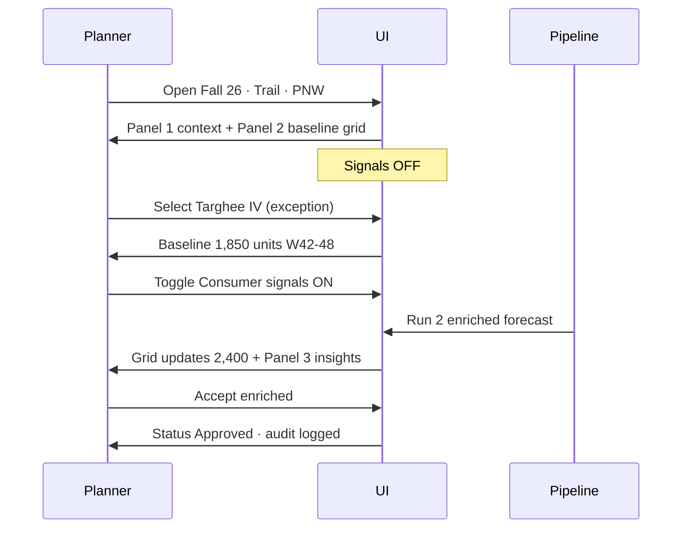

# Show & Tell — Demand Planner UI Wireframe
**Forward Deploy Consulting · May 2026 · Draft v0.1**

Scope: **Demand forecasting only** — mirrors Toolio’s in-season tournament-forecast slice, stops before allocation/replenishment/PO.

Persona: **Parvi** — demand planner, outdoor/footwear mid-market (Keen-like).

Demo hook: **Run 1 (baseline)** vs **Run 2 (consumer signals on)** — same SKU × region × week grid; delta visible in center panel + right panel.

---

## Layout overview

```
┌─────────────────────────────────────────────────────────────────────────────┐
│  Top bar: Season · Planner · [Consumer signals OFF | ON]  · Last refresh    │
├──────────────┬──────────────────────────────────────────┬─────────────────┤
│  PANEL 1     │  PANEL 2                                 │  PANEL 3        │
│  Merch plan  │  Forecast grid (primary workspace)       │  Signals + HITL │
│  context     │                                          │                 │
│  (~20% w)    │  (~55% w)                                │  (~25% w)       │
│  read-only   │  editable overrides                      │  review/approve │
└──────────────┴──────────────────────────────────────────┴─────────────────┘
│  Footer: "Forecast only — buy, allocation, replenishment consume downstream" │
└─────────────────────────────────────────────────────────────────────────────┘
```

**Not in scope (greyed or absent):** Style bank, rationalization wizard, allocation map, transfer orders, ERP PO export.

---

## Panel 1 — Merch plan context (read-only)

**Purpose:** Ground the planner in *why this category matters financially* without opening MFP spreadsheets. Toolio analogue: merchandise plan targets that assortment/forecast must reconcile to.

| Element | Content (sample) |
|---|---|
| Season | Fall 2026 · Week 42 in-season |
| Category | Footwear › Trail · `$4.2M` OTB remaining |
| Plan vs actual YTD | Sales `102%` · Margin `98%` · Units `99%` |
| Planner note | "Trail running up; waterproof lagging in PNW" |

**Interactions:** Expand/collapse hierarchy (Division › Category › Class). No editing in Show & Tell — click-through only.

**Copy for demo:** "Financial plan lives here. Forecast grid in the center must roll up to these targets — we're not rebuilding MFP, just showing context."

---

## Panel 2 — Forecast grid (primary)

**Purpose:** Excel-like workspace — the planner's daily home. Toolio analogue: in-season tournament forecast view (original vs system-adjusted vs actuals).

### Grain
- **Rows:** Style/SKU (e.g. `KEEN-1024 Targhee IV Mid WP · Earth Brown`)
- **Columns:** Week (W42–W48) + row totals
- **Filter chips:** Region `Pacific NW` · Channel `All` · Cluster `Seattle + Portland`

### Column groups (per week)

| Column | Run 1 (baseline) | Run 2 (signals on) |
|---|---|---|
| Baseline forecast | ✓ always | hidden or ghost |
| System forecast | same as baseline | tournament + consumer adjustment |
| Actuals (WTD) | ✓ | ✓ |
| Override | planner entry | planner entry |
| Δ vs baseline | — | `+550` highlighted |

### Row summary strip (selected SKU)
```
W42–W48 total units
  Baseline:     1,850
  Enriched:     2,400  (+29.7%)
  Confidence:   0.82
  Status:       Pending review
```

### Visual cues
- **Amber row** in exception queue = largest positive delta after signals
- **Strikethrough / muted** baseline when toggle ON (show delta, not two full grids)
- Sparkline per row: last 8 weeks actuals (optional v2)

### Planner actions
1. Select SKU from exception list or search
2. Drill week cells — inline edit override
3. Click **Review enriched forecast** → opens Panel 3 focus

**Do not show:** Store-level allocation columns, receipt plan, safety stock.

---

## Panel 3 — Signals + human-in-the-loop

**Purpose:** Explain *why* the number changed in planning language. Toolio analogue: true demand + model confidence; **your wedge:** consumer loop signals.

### Section A — Exception queue (top)
| Priority | Style | Region | Δ units | Driver |
|---|---|---|---|---|
| 1 | Targhee IV Mid WP | PNW | +550 | Intent + member gap |
| 2 | Jasper Chukka WP | PNW | +120 | Search spike |
| 3 | Revel IV | National | −80 | Guest-heavy, no signal |

### Section B — Five planner insights (from clickstream + loyalty)
Mapped to meeting discussion — each insight ends in **units / SKU / week**:

1. **Search spike** — `+34%` "waterproof hiking boot" PNW, W42–44 → `+220 units`
2. **Browse-to-buy gap** — High CLV members viewed Targhee IV, size 10 OOS 6 days → `+180 units`
3. **Cart abandon** — 412 abandons on style, 61% size-related → sizing curve flag (not allocation)
4. **Member vs guest** — Member demand `+31%` vs baseline; guest flat → split visible in grid filter
5. **Replacement cadence** — Repeat buyers due W45–46 → `+150 units`

### Section C — Model transparency
```
Forecast method:  Ensemble (won tournament for this SKU-cluster)
Consumer layer:   ON — Forward Demand Signal v0.3
Confidence:       0.82
Last refresh:     Today 06:00 PT
```

### Section D — Human-in-the-loop (bottom, sticky)
| Control | Behavior |
|---|---|
| Toggle | **Use consumer signals for this style** (default OFF in Run 1 demo) |
| Buttons | `Accept enriched` · `Keep baseline` · `Edit override only` |
| Audit | Log: signal sources, confidence, approver, timestamp |

**Run 1 demo flow:** Toggle OFF → grid shows baseline only; Panel 3 insights greyed ("Connect consumer loop to enable").

**Run 2 demo flow:** Toggle ON → grid animates delta; insights populate; planner clicks Accept.

---

## Top bar

| Item | Spec |
|---|---|
| Product filter | Style search, category breadcrumb |
| **Consumer signals** | Master toggle OFF/ON (drives Run 1 vs Run 2) |
| Compare mode | Optional: side-by-side baseline vs enriched (advanced) |
| Refresh | Simulated "Last run: 2 min ago" |

---

## Screen flow (Show & Tell script)



**Talk track (~5 min):**
1. "This is what Parvi sees Monday morning — exceptions, not a blank spreadsheet."
2. Run 1: "Only history + promo. Seattle boot flat."
3. Flip toggle: "Same pipeline, consumer signals on."
4. Panel 3: "Not a marketing dashboard — five insights in units."
5. Accept: "Human-in-the-loop. Nothing hits buy/allocation without approval."
6. Footer: "We stop at forecast. Your ERP/allocation consumes this number."

---

## Sample data (Keen-like, one hero SKU)

**Style:** KEEN-1024 Targhee IV Mid WP  
**Region:** Pacific NW (Seattle, Portland, Spokane clusters)  
**Weeks:** 42–48 (late Oct – mid Dec)

| Week | Baseline | Enriched | Actuals (partial) |
|---|---|---|---|
| W42 | 240 | 310 | 298 |
| W43 | 265 | 340 | — |
| W44 | 270 | 355 | — |
| W45 | 280 | 365 | — |
| W46 | 275 | 360 | — |
| W47 | 260 | 335 | — |
| W48 | 260 | 335 | — |
| **Total** | **1,850** | **2,400** | |

---

## Component checklist (build order)

| # | Component | Phase |
|---|---|---|
| 1 | 3-panel shell + top bar toggle | POC |
| 2 | Forecast grid (static data) | POC |
| 3 | Panel 1 merch context (static) | POC |
| 4 | Panel 3 insights list (static) | POC |
| 5 | Toggle rewires grid + insights | POC |
| 6 | HITL approve + audit log | POC v2 |
| 7 | Live pipeline hook | Production |

---

## Out of scope reminder (footer + sales)

- Assortment line building / style bank  
- Allocation command center / transfer orders  
- Replenishment triggers / WMS  
- PO export to ERP  

---

*Companion interactive wireframe: open the canvas beside this chat.*
